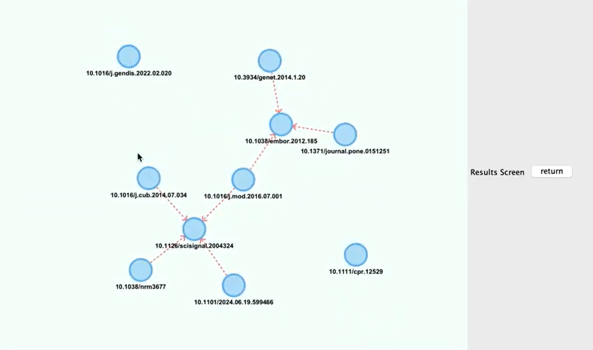
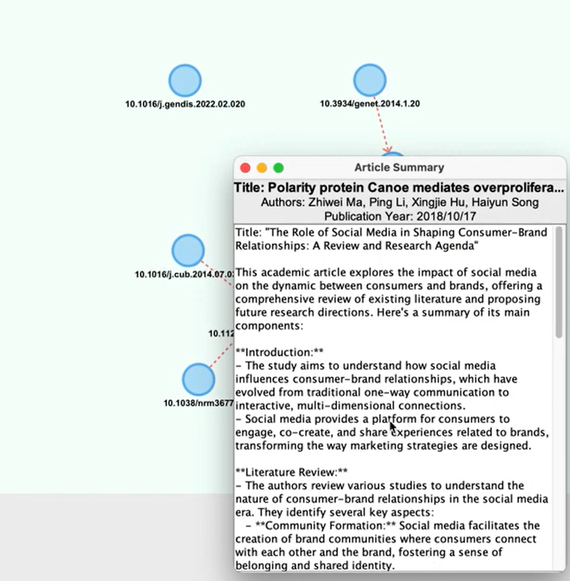

# Research-Paper-Reference-System
An application built for students to help them search for and cite research articles.

## Table of Contents

1. [Description](#1-Description) 
2. [Purpose](#2-Purpose)
3. [Installation Guide](#3-Installation-Guide) 
4. [Usage Guide](#4-Usage-Guide)
5. [License](#5-License) 
6. [Feedback](#6-Feedback) 
7. [Contributions](#7-Contributions) 
8. [Authors](#8-Authors) 

## 1. Description
The Research Paper Reference System is a tool designed to aid students and researchers in locating, visualizing, and citing research papers relevant to their topics of interest. It helps users streamline their research process by providing features such as web scraping, data analysis, and graph-based visualization of research paper networks.

### Features
#### Search and Data Handling: 
The program will web scrape the provided API to get data on relevant research papers. Using this data, it will analyze and summarize the paper, and determine it’s relevance to the research topic and its relationship to other similar research papers. 

#### Graph Visualization:  
A directional graph will be used to display all the research articles associated with the topic searched. The nodes of the graph will represent a research paper. The edges of the graph, which will be directional, will represent citations (e.g. A -> B means A cites B). 

#### User Interaction:  
Using Java Swing, the program allows users to enter research topics and see relevant papers in the form of a graph. By clicking and dragging the graph, users can get a clearer view. Users are provided with the option to click a node for detailed information. They are also able to login in to save and check their search history and bookmark important papers for later access. 

### Examples (User Stories):
- As a student writing a paper on “Should Ontario School Board need to ban phones in classrooms”, I am unsure about where to start. I enter some keywords into the search bar, which generates a graph displaying the 10 most relevant articles. Articles that cite each other (and are thus more related) are visualized, allowing me to easily identify which group of articles are most relevant to my topic, and which articles may be used to further extend my research in a particular direction. When you touble click on each articles, you will be given the summarization of the article, the title and the public Year of the article. [team story] 
- As a student, I want to be able to sign up/log in to the research paper database in order to be able to see my search history everytime. As a User I also want to see some nice UI [Bowen]
- As a student writing a research paper on Alzheimer's disease, I want to be able to type in my topic in the search bar and search for research papers relevant to my topic. [Liz]
- As a student writing a research paper on the role of pets in reducing stress, I want to be able to be shown a summarization View of the most relevant paper, including the title, authors, publications year and the detailed summarization of the article. The application should have an API implented to summarize the provided article. [Joyee]
- As a student writing a research paper on the hippo pathway, I want to be able to use the generated directed graph to see which paper cite which. This way, I can see which paper is the most recent (as it cites most of the other papers) or which paper contains the most fundamental information (as most of the other papers cite it), and then use the one that corresponds most with what I want in my own research paper. [Ashley]
- As an User, we want to be able to cancel searches and cancel login, allowing users to be more free on the application [Amy]

## 2. Purpose
This application was created to address the common challenge students face when starting their research journey, which is finding credible and relevant research articles. By offering a visually intuitive and interactive interface, this system enhances users' ability to explore interconnected articles to find strong  references for their work.

## 3. Installation Guide
### Prerequisites
- Java JDK 12+
- Maven 3.6+
- Internet connection for API access

### Steps
1. Open your terminal, clone the repository using the following command: git clone https://github.com/zjoyjin/Paper-Reference-System.git
2. Ensure Maven and Java are installed. Check their versions.
3. Use Maven to compile the project and resolve dependencies.

### Common Issues
- Make sure the versions of packages are correct.
- Mark the src folder as the source root.

## 4. Usage Guide
- Go to Main.java, click the green run button. You should be able to see the sign up page.
- 
- Create your username and password, then click the sign up button. It should direct you to the login page.
- 
- Enter your password and click login. If the password is correct, it will direct you to the logged in page.
- 
- If you want to search for references now, click go to search. 
- 
- Enter your topic and you will get a graph with ten articles relevant to the topic. You will be able see and select your search history in the pop up menu on the bottom of the page.
- 
- Double click on the nodes to see a summary of the article. Or you can click return to go back to the search page.
- 

## 5. License
This project is in the public domain.

## 6. Feedback
We welcome feedback to improve the experience. 
### How to submit
Please use the following link to provide feedback: [Feedback Google Form](https://forms.gle/ighqLjdngWmQaRkr9)
### Valid Feedback
We encourage constructive feedback that helps improve the application. Examples of valid feedback include:
- Bug reports with clear steps to reproduce the issue.
- Suggestions for new features or improvements.
- Comments on user interface design and usability.
### What to expect
- Your feedback will be review within 1-3 business days.
- For bug reports, you will be notified once we fix the issue.
- Accepted suggestions will be implemented in future updates.

## 7. Contributions
Contributions to the system is encouraged.
### Steps to contribute
- Open the [repository](#https://github.com/zjoyjin/Paper-Reference-System) on github, click the fork button to make a fork of the repository.
- Clone your fork to your local computer. Make your own branch.
- Modify or add to the code, then commit your changes.
- Push the branch and submit a pull request.
### Protocals
Your pull request will be reviewed in 1-3 business days. It will be accepted if: 
1. The code is organized and highly readable. 
2. It successfully solves the intended problem or adds a new function. 
3. The changes doesn't break existing functionality.
### Contribution guidelines
- Write clear and concise pull request messages. The title should clearly state the purpose of the pull request, and the description should include what it does and why it is necessary. 
- Follow coding standards, code in a consistent and readable style.
- Include relevant tests.

## 8. Authors
1. Joyee Jin @zjoyjin
2. Ashley Bi @trashb
3. Amy Sun @amysun11
4. Bowen Zhang @SuperBowen
5. Elizabeth Liu @lizzie_liu

